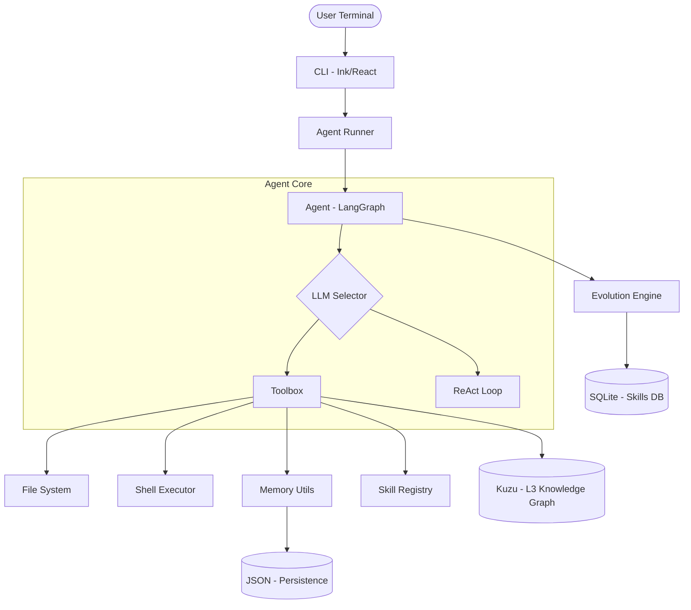

# AgentLag Architecture

AgentLag is an autonomous terminal-based AI agent designed for software engineering tasks. It features a multi-provider LLM backend, a skill-evolution engine, and persistent memory across sessions.

## System Overview

The system is built on top of **LangGraph** to manage the agent's control flow, using a directed acyclic graph (DAG) to handle decision-making and tool execution.

### High-Level Component Diagram

## Core Components

### 1. CLI (cli.jsx)
Built with **Ink**, it provides a React-like experience in the terminal. It handles user input, displays streaming responses, and manages interactive tool confirmations.

### 2. Agent Runner (agent_runner.js)
Coordinates the execution of agent turns. It:
- Manages streaming output.
- Handles tool execution confirmation logic.
- Implements retry logic for ReAct mode.
- Records session interactions for the Evolution Engine.

### 3. Agent Logic (agent.js)
The brain of the system, powered by **LangGraph**.
- **Tools Mode**: Uses native function-calling capabilities of modern models (OpenAI, Anthropic, etc.).
- **ReAct Mode**: A fallback mechanism for models without native tool calling, using a structured Thought/Action/Observation loop.
- **Recursion Limits**: LangGraph is configured with a 30-step limit, while ReAct mode has an internal 15-iteration cap to prevent infinite loops.

### 4. Skill System (skills.js & skill_registry.js)
Allows extending the agent's capabilities via "skills".
- **Discovery**: Scans local (`.agents/skills`) and global (`~/.agents/skills`) directories.
- **Persistence**: Uses **SQLite** (`openspace_skills.db`) to store skill versions and performance metrics.
- **Evolution**: The **Evolution Engine** analyzes successful task recordings and proposes new skills or fixes to existing ones.

### 5. Knowledge Graph (kuzu_utils.js & kuzu)
Implements an **L3 Knowledge Graph** using **Kuzu DB**.
- Stores entities and relationships extracted from sessions.
- Allows the agent to query historical context and project-specific knowledge using Cypher.

### 6. Memory (memory_utils.js)
A lightweight persistence layer (`memory.json`) used to store user preferences, project-specific rules, and long-term context.

## Data Flow

1. **Input**: User sends a prompt through the CLI.
2. **Context Enrichment**: The runner injects active skills and relevant memory into the system prompt.
3. **Reasoning**: The LLM determines the next action (text response or tool call).
4. **Execution**:
    - If it's a tool call, the agent pauses for user confirmation (if required).
    - The tool executes and returns the result (Observation) to the LLM.
5. **Evolution**: After the task finishes, the recording is sent to the Evolution Engine to potentially capture a new reusable skill.

## Technology Stack

- **Runtime**: Node.js (ES Modules)
- **AI Framework**: LangChain / LangGraph
- **UI**: Ink (React for CLI)
- **Database**: SQLite (Skills) & Kuzu (Knowledge Graph)
- **LLM Support**: OpenAI, Anthropic, Groq, OpenRouter, Mistral, DeepSeek, NVIDIA, Lightning AI, Ollama.
